<div align="center">
  <picture>
    <source media="(prefers-color-scheme: dark)" srcset="./dark.svg">
    <source media="(prefers-color-scheme: light)" srcset="./light.svg">
    
  </picture>
</div>

---

### ↳ ~/about-me

Hi, I'm **Saksham Garg**. I'm a Data Science student (Class of 2028) and Backend Developer focusing on building scalable, intelligent systems. I prefer keeping things efficient, minimal, and data-driven. 

- 🔭 **Currently Working On:** - A comprehensive global connectivity data visualization project (mapping data transfers across a monochrome Earth model).
  - Designing a sleek, modern personal portfolio tailored for technical data science showcases.
- 💼 **Experience:** Backend Developer Intern at Intangles Lab, Pune.
- 🌱 **Learning:** Advanced LLM architectures, RAG pipelines, and sophisticated data visualization techniques.
- 💬 **Ask me about:** Python, AI-powered SaaS (like CrewAI), and Backend microservices.

### ↳ ~/tech-stack

```text
Languages      :: Python, SQL, JavaScript, HTML, CSS
Backend        :: FastAPI, Flask, Node.js, RESTful APIs, Microservices
AI & ML        :: LLMs, RAG, LangChain, CrewAI, Vector Databases, Data Analysis
